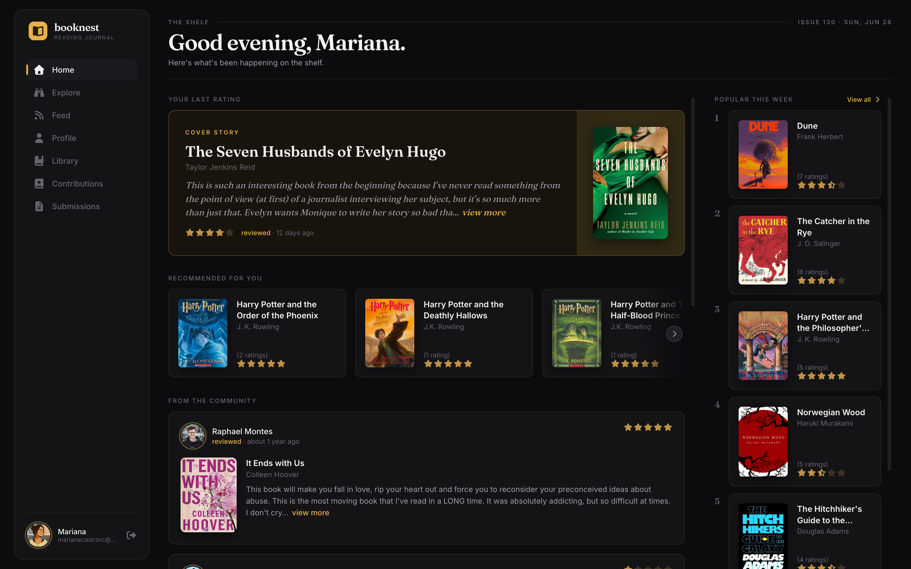
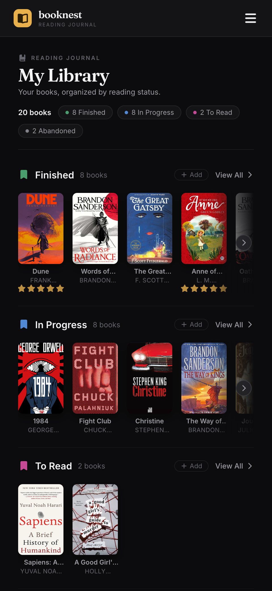

<div align="center">


# Book Nest

**📖 Reading Journal**

A modern book tracking and rating platform. <br/>
Discover, track and share your reading journey.

<br/>

[](https://book-nest.marianacastro.dev)
[](#-features)
[](#ℹ%EF%B8%8F-how-to-run-the-application)

<br/>



</div>

<br/>

## 📚 Features

|  |  |
|---|---|
| **📖 Track Your Reads** | Organize and track books you've read, are reading, want to read, or didn't finish. |
| **⭐ Rate & Review** | Share your thoughts, rate books, and vote on what other readers think. |
| **🧭 Explore Books** | Discover new books, search by category, and get personalized recommendations. |
| **📊 Reading Insights** | See your reading stats — pages read, authors explored — and keep your progress on track. |

<br/>

## 🖼️ Screenshots

<table>
  <tr>
    <td align="center" width="62%"><strong>Desktop</strong></td>
    <td align="center" width="38%"><strong>Mobile</strong></td>
  </tr>
  <tr>
    <td valign="top"></td>
    <td valign="top"></td>
  </tr>
</table>

<br/>

## 🛠️ Tech Stack

<p>
  
  
  
  
  
  
</p>

| Category        | Technologies                                        |
|-----------------|------------------------------------------------------|
| **Framework**   | Next.js 15 (Pages Router), React 18                 |
| **Language**    | TypeScript 5                                        |
| **Styling**     | Tailwind CSS v4, Radix UI, Framer Motion            |
| **Database**    | PostgreSQL + Prisma 6                               |
| **Authentication** | NextAuth.js v4 (Google, GitHub, Credentials)     |
| **Data & Forms** | SWR, React Hook Form, Zod                          |
| **Testing**     | Jest, React Testing Library                         |
| **Tooling**     | ESLint, Prettier                                    |

<br/>

## 📝 Project Description

The application consists of a book rating platform, where the reader can see recommendations from other readers and also make their own ratings of the books they have already read. Additionally, users can search for books by categories and check data about their reading history, such as the total number of pages and authors they have read. The app also features social authentication through a Google or GitHub account.

Users can track their reading progress by marking books with different statuses: read, reading, did not finish, and want to read. This feature helps users organize and monitor their personal reading history.

Users can also submit new books to the platform by providing the ISBN. Upon submission, the app fetches detailed technical data from external sources using the Google Books API and the Open Library API, enriching the platform's book database.

**Additional features:**

- **Explainable, evaluated recommendations:** The home page surfaces up to 4 books tailored to each user. See the [dedicated section](#-recommendation-engine) below — the ranking is a pure, unit-tested core that blends a Bayesian-damped community rating with a category-affinity signal, tells the user _why_ each book was picked, and is measured with an offline hold-out evaluation.
- **Rating votes:** Users can upvote or downvote other readers' reviews, helping surface the most helpful ratings.
- **Edit profile:** Users can update their name and avatar directly from their profile page, including an image cropper for precise photo editing.
- **Book submission moderation:** Submitted books go through a review flow before being published. Moderators can approve or reject submissions from a dedicated submissions page.
- **Readers directory:** A dedicated page lists all registered users, making it easy to discover other readers and visit their profiles.
- **Pagination and debounced search:** Book and reader listings are paginated and support real-time search with debounce to avoid unnecessary requests.
- **Responsive layout:** The app is fully responsive, with a mobile sidebar and adaptive navigation for smaller screens.
- **Animated transitions:** Page and component transitions use Framer Motion for a polished feel.

<br/>

## 🧠 Recommendation engine

The "Recommended for you" rail isn't a popularity list — it's a small ranking system that is **explainable** (it tells you why) and **measured** (its quality is tested, not assumed). The scoring logic lives in a pure, dependency-free module ([`src/lib/recommendation/score.ts`](src/lib/recommendation/score.ts)) so it can be unit-tested and evaluated offline without a database.

A book's score blends two signals, each normalized to `[0, 1]` so the weights actually mean what they say (`0.6 · quality + 0.4 · affinity`):

- **Quality — a Bayesian-damped rating.** A raw average is a trap: a book with a single 5★ would outrank a book with 200 ratings at 4.6. So instead of the mean, each book gets a Bayesian estimate (the "true Bayesian"/IMDB weighted rating):

  ```
  (C · m + Σ ratings) / (C + n)
  ```

  where `m` is the global mean rating and `C` is a prior strength. With few ratings the score sits near the global mean; as ratings accumulate it converges to the book's real average. This is what neutralizes cold-start hype.

- **Affinity — a share of demonstrated taste.** From the books a user rated 4★+, I build a probability distribution over categories (summing to 1). A candidate's affinity is the summed weight of the categories it shares with that distribution — so a book in your two favorite genres scores far higher than one in a genre you've touched once.

**It explains itself.** Each recommendation carries structured reasons (`Because you like Fantasy & Adventure`, `Highly rated by readers (4.4★)`), rendered as a chip on the book card — so the rail is legible instead of a black box.

**It's evaluated, not asserted.** A leave-one-out hold-out test ([`src/tests/lib/recommendation/score.test.ts`](src/tests/lib/recommendation/score.test.ts)) builds synthetic users with known tastes, hides a book each would love, drops it into a pool of distractors (off-taste hits, on-taste duds, cold-start hype, noise), and checks whether the ranker surfaces it. Over 400 deterministic trials it reports **hit-rate@4 ≈ 0.85** and **MRR ≈ 0.77**, against a random baseline of ~0.15 — turning "I built a recommender" into "I measured my recommender". Run it with `npm test`.

<br/>

## 📌 What did I learn?

The most challenging part of this project was creating routes and endpoints for interacting with the database. Since the registered data had many relationships among themselves, and there were some data that needed to be calculated in the request body, it required a well-thought-out logic to obtain them at times. The application is also covered by automated tests implemented with Jest, ensuring reliability and maintainability of the codebase.

<br/>

## ℹ️ How to run the application?

> Clone the repository:

```bash
git clone https://github.com/maricastroc/book-nest
```

> Install the dependencies:

```bash
npm install
```

> Rename the .env.example file to .env and add the necessary information to it.

> Generate the Prisma client and apply database migrations:

```bash
npx prisma generate
npx prisma migrate dev
```

> Start the service:

```bash
npm run dev
```

> Run all tests:

```bash
npm run test
```

> ⏩ Access [http://localhost:3000](http://localhost:3000) to view the web application.

<br/>

<div align="center">

⭐ If you like this project, give it a star on GitHub!

</div>
